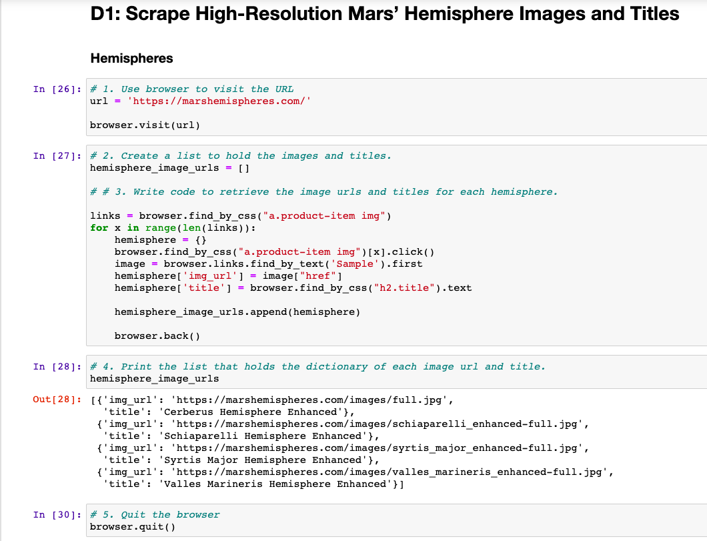
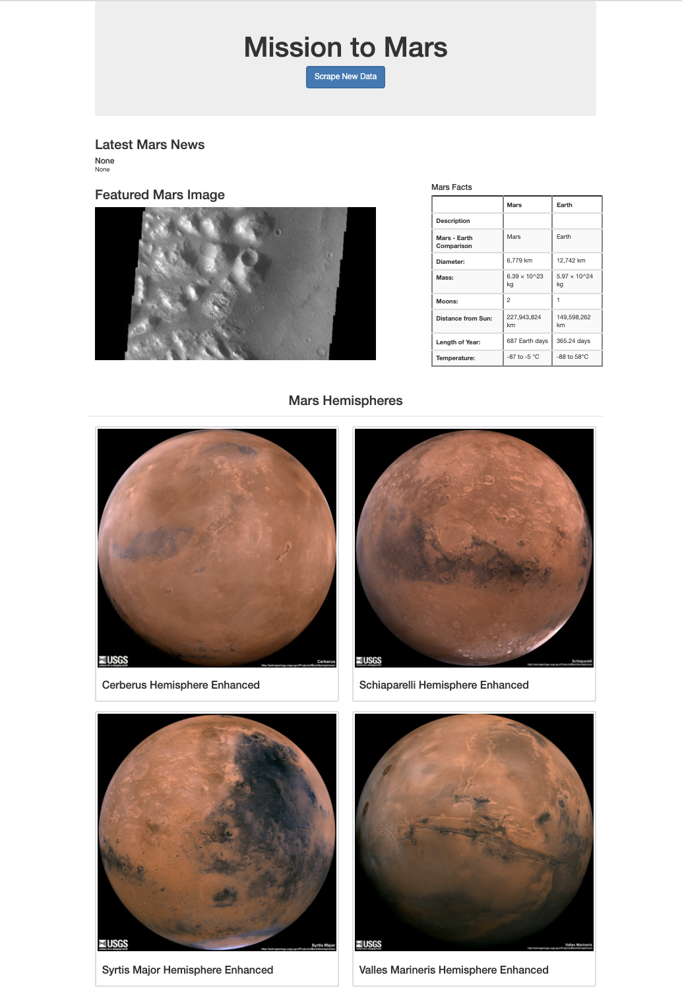

# **Module10-Mission-to-Mars**
## **MongoDB, Splinter, Web-Driver Manager, Beautiful Soup, Flask**

## **Purpose of the Project**

### To build a Web APP to scrape data and images from websites and to create an HTML page to show the results.

### Step 1 Scrape full-resolution Mars Hemisphere images and titles.

####    1. Write a code to retrieve title and full resolution image for each hemispere image.
####    2. Add the titles and images to dictionaries.
####    3. Create a list containing the dictionaries.
####    4. Save it as .py file
        

### Step 2 Update the web app with Mars Hemisphere images and titles.

####    1. Update scraping.py file with the code from step 1.
####    2. Update Mongo database and modify index.html file

### Step 3 Add Bootstrap 3 components to style the web page.

### Below is the final web page:

